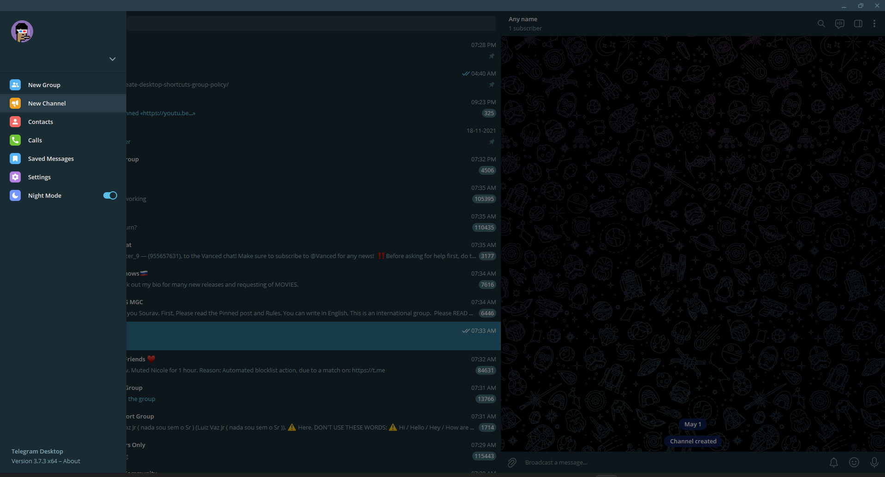

# ScreenshotToTelegram

This is a simple script that takes a Screenshot of your current screen and sent it to your Telegram Channel

## Instructions

- Make a bot using @BotFather in Telegram.
- Copy your Bot APi key and bot username.
    

- Create a new Channel.
- It can be either public or Private.
    

- Add your bot to the channel as Admin.

    

- Sent some Test messages to the channel.
    

- Go to the link '{https://api.telegram.org/botYOURBOTAPITOKEN/getUpdates}'

- Copy the  ID from "sender_chat":{"id":ID  from the link. 
- include the "-" sign with the ID
- Replace the data in the Code.
    
    

- Save the script on the desktop.

### Create Keyboard shotcut for the script.

- Create a shotcut of the file in the desktop. 

    

## Demo 

- Press the keyboard shotcut configured(in my case ctrl + alt + x )

## Authors

- [@ajuroshan](https://www.github.com/ajuroshan)

